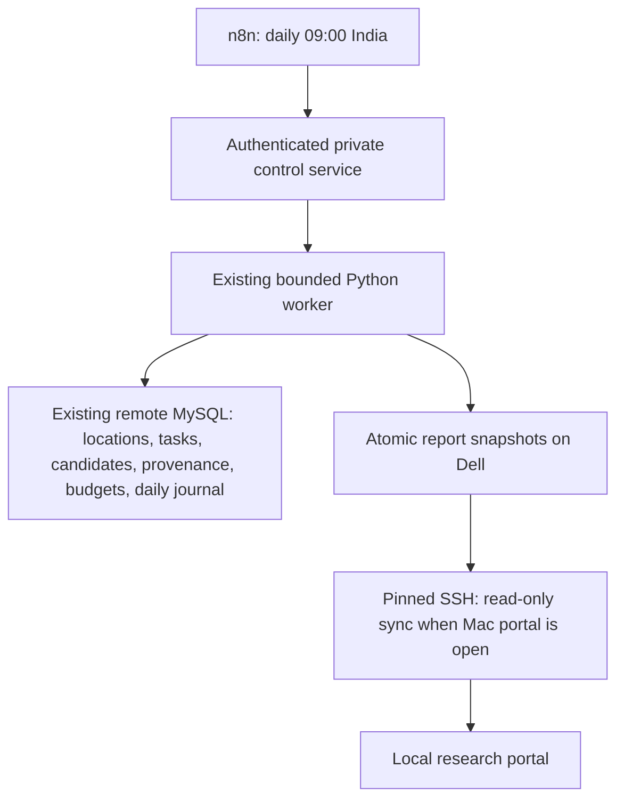

# Jai Bhole Nath daily discovery on Devashish Node

Deployed and checked on 30 September 2026. Research owner: Devashish Pawar.
Engineering and migration assistance: Codex. Automated checks are not independent
human review or verification of temples.

## Running arrangement

The Dell now owns daily discovery. The n8n workflow **Jai Bhole Nath - Daily
Discovery** (`jbnDailyDiscovery`) is published for **09:00 Asia/Kolkata**.
The former Mac automation **Daily Shiva discovery expansion** is paused.



This is a packaging and execution migration, using the existing worker and
authoritative database. The Dell's PostgreSQL remains n8n's database. The
existing classification, normalization, deduplication, geographic auditing,
and budget logic were copied without rewriting them.

| Responsibility | Existing or new component |
| --- | --- |
| Master location queue | MySQL `india_locations` and `temple_search_tasks` |
| Candidate storage | MySQL `temple_candidates`, retaining provider fields and Place IDs |
| Search occurrence and attribution history | MySQL `candidate_discovery_events` |
| Daily journal and duplicate-run protection | MySQL `discovery_expansion_batches` and advisory lock |
| Monthly request accounting | MySQL `places_monthly_budgets`, `places_request_reservations` |
| Schedule and execution outcome | n8n workflow; private control-service history |
| Reports | Immutable snapshots and atomic `latest.json` on Dell |

This increment does not introduce a separate archive of full raw API response
JSON. It retains the existing candidate fields and occurrence history. Data
retention and public release remain subject to the project's data policy.

## Installed paths

Ubuntu app: `/home/devashish/devashish-node/apps/jbn-discovery`.

Persistent output: `/home/devashish/devashish-node/data/jai-bholenath/expansion`.
Control records: `/home/devashish/devashish-node/data/jai-bholenath/control`.
Each invocation records mode, start/end time, exit code, status, request count,
and report manifest in `history/<invocation-id>.json`. `latest.json` tracks the
last operation; `last-daily.json` separately tracks discovery so preflight and
export operations cannot disguise a failed daily run.

The container joins `n8n_default` and `uptime-kuma_default`; its port is not
published to the host. Credentials are provisioned privately in `worker.env`
and `control-token.txt`, excluded from the image and this deliverable. The n8n
header credential is encrypted using the instance's existing configuration.

Docker restarts the container automatically. Windows Task Scheduler has
**Devashish Node WSL Keepalive**, triggered at startup and logon, running as the
existing Windows account using S4U without a saved password. It starts Ubuntu
and holds a WSL process open. Docker is enabled under Ubuntu systemd. Task
startup and full Windows reboot recovery were verified on 30 September.
The boot keepalive and all four Docker containers started automatically; no
manual service-start commands were needed.
AC sleep was already disabled. Battery sleep remains unchanged.

## Limits and budget requirements

Every live invocation uses:

```sh
python scripts/run_expansion_batch.py \
  --limit 10 --max-requests 30 --max-pages 3 \
  --state 'Uttar Pradesh' --location-type urban_local_body
```

n8n cannot supply different limits or locations through the control endpoint.
HTTP retries are disabled. The shared journal skips completed days and blocks
interrupted runs. No task rows, run rows, or request reservations were reset.

Billing usage must still be confirmed from a real observation within 24 hours.
The observed timestamp must never be refreshed without checking usage. A new
Pacific billing month requires explicit configuration with the existing
`scripts/places_budget.py` runbook. The schedule stays enabled when blocked;
it makes no Google requests until the existing checks permit execution.
Automated billing reconciliation is not configured.

The owner confirmed 46 September Places requests, checked at 15:44 IST on
30 September, covering the full September period and the only Places-consuming
project on the billing account. This observation is now recorded in the existing
budget. The latest Dell preflight returned HTTP 200 with `status=dry_run`,
430 matching pending tasks and 1,304 remaining requests under the unchanged
1,350-request ceiling. The reserve and 46 existing reservations were preserved;
no Google requests were made during the refresh.

The next 09:00 IST run on 1 October still falls in the September Pacific billing
month. October begins at 12:30 IST on 1 October; that month requires its own
explicit configuration based on actual usage. The daily schedule remains active
and blocks safely whenever the required observation or monthly budget is missing.

The existing MySQL connection uses TLS. Its provider CA is not configured for
certificate validation; validation with the system CA failed. The migration
preserves the existing connection settings rather than inventing a provider CA.

## Private control and monitoring

Authenticated POST endpoints, requiring header `X-JBN-Token`:

- `/preflight`: read-only baseline, database, queue and budget validation.
- `/export`: publish already-saved candidates without Google requests.
- `/run`: bounded daily discovery; `.env` must set `JBN_LIVE_ENABLED=true`.

Only an empty JSON object is accepted. GET `/status` requires the same header.
Tokens and raw child logs are excluded from service access logs.

Kuma can reach these HTTP URLs from its existing Docker network:

- `http://jbn-discovery:8787/health`: service liveness.
- `http://jbn-discovery:8787/health/daily`: HTTP 200 for a successful daily
  result within 36 hours; HTTP 503 for a failed/blocked/stale result.

Network reachability and HTTP 200 were checked from the Kuma container. These
endpoints are ready for monitors; no Kuma monitor or notification channel was
created in this migration.

## Mac portal

The existing local Vite portal starts read-only sync in the background when it
checks the expansion manifest, at most once per minute while open. The browser
continues showing its last successful snapshot while sync runs. No Mac discovery
process is scheduled.

`scripts/sync_dell_reports.py` uses private, git-ignored `.node-access/` SSH
configuration. It checks the pinned Dell host key, validates the snapshot's
content hash and counts, and writes the snapshot before changing the pointer.
A failed connection or corrupt export leaves the prior local data intact.
The frontend server also denies access to `.node-access/`. Public builds do not
include this sync process or private credentials.

## Verification evidence

- Existing worker tests: 72 passed. With the new control and report-sync tests: 81 passed;
  13 optional disposable-MySQL integration tests skipped.
- Control service and sync package tests: 9 passed, including HTTP auth,
  fixed limits, concurrency, budget blocks, timeouts, hash validation, and
  preservation of the last good report.
- Frontend: 50 tests passed; production build passed.
- Dell Docker build succeeded; worker and existing services are healthy.
- Dell export reproduced snapshot
  `df7b7f078aa6c296b6bc49dcd18654382762b6ce33ec7cfa4e1397a9ac4527dc`:
  74,673 combined discovery candidates, 564 database candidates, 556 additions
  since baseline, and 8 overlapping Place IDs.
- Actual n8n manual execution returned `already_ran`, `requests=0` for
  30 September. The ledger stayed at 46 reservations and the daily journal
  retained its single completed row. No Google requests were made during migration.
- Local portal returned HTTP 200 with 74,673 candidates; its private SSH key
  path returned HTTP 403. Mac SSH sync verified that same content hash. Both the new discovery workflow
  and the existing website-check workflow are published.

These are discovery candidate counts, not verified temple totals. The first
new daily discovery execution remains to be observed. Full Windows reboot
recovery passed: services, published schedule, budget, reports and Mac sync
were checked after reboot, with zero Google requests.

## Recovery

Inspect the saved result and MySQL journal before retrying an interrupted run.
Never clear journal rows, reset task states, or adjust budget usage to force
progress. Export-only can refresh reports without new discovery.

For a rollback, first stop publishing the Dell workflow and set
`JBN_LIVE_ENABLED=false` after any active run finishes. Then resume the saved Mac
automation through Codex's automation controls. Continue using the same MySQL
database and budget scope. Avoid two independently restored databases performing
live discovery.

The package and baseline on Dell, the private environment files, report outputs,
and control history should be included in private node backups. The authoritative
remote MySQL database needs its own consistent backup; report snapshots do not
contain its queue or request ledger. Backup restoration was not tested here.

See the existing `docs/AUTOMATED_DISCOVERY.md` and billing runbook.
Schedule publishing and timezone behavior follow the official
[n8n Schedule Trigger documentation](https://docs.n8n.io/integrations/builtin/core-nodes/n8n-nodes-base.scheduletrigger.md).
